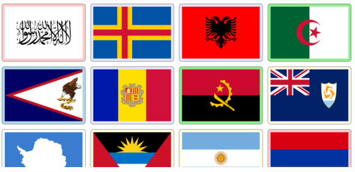
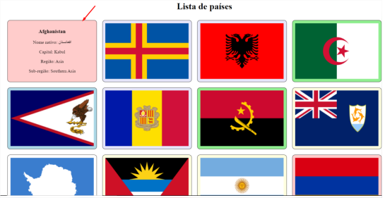
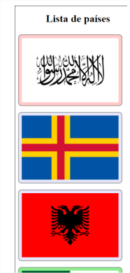

# Desafio IGTI Front End - Módulo 01

## Objetivos

Exercitar os seguintes conceitos vistos em sala de aula:

- [x] HTML Semântico.
- [x] CSS Estilos e Animações.
- [x] Metodologias CSS.
- [x] Pseudoelementos e pseudoclasses.
- [x] CSS Pré-processadores.
- [x] Layout CSS Moderno.

## Enunciado

O objetivo deste trabalho é usar o que foi aprendido nas aulas e fazer com que o site provido seja:

- Semanticamente coerente de acordo com as regras do HTML semântico.
- Responsivo.
- Com as devidas animações pedidas.

O projeto será feito em HTML, SASS e JavaScript puro (Vanilla), e será usado Flexbox para
organização do posicionamento do conteúdo.

## Atividades

Os alunos deverão desempenhar as seguintes atividades:

- [x] Pegar os dados da API de países (https://restcountries.com/) usando fetch().

- [x] Mostrar todos os países da lista em estilo de flip card, conforme design a seguir:



- [x] O tamanho do card é de width: 300px e height: 200px
- [x] A cor de background depende do continente onde o país se encontra:

```css
.Africa
    background-color: lightgreen
.Americas
    background-color: lightyellow
.Asia
    background-color: #ffcccb
.Europe
    background-color: lavender
.Oceania
    background-color: lightblue
```

- [x] Quando é passado o mouse sobre o card (hover), acontece a rotação de “flip” no card e mostra as informações do país de nome, nome nativo, capital, região e sub-região:



- [x] Os estilos devem ser feitos usando o SASS;

- [x] O design deve ser responsivo, de forma a se adequar a telas pequenas:



- [x] Criar as tags HTML e os seletores SASS para que eles se adequem à metodologia BEM (Block, Element, Modifier)
